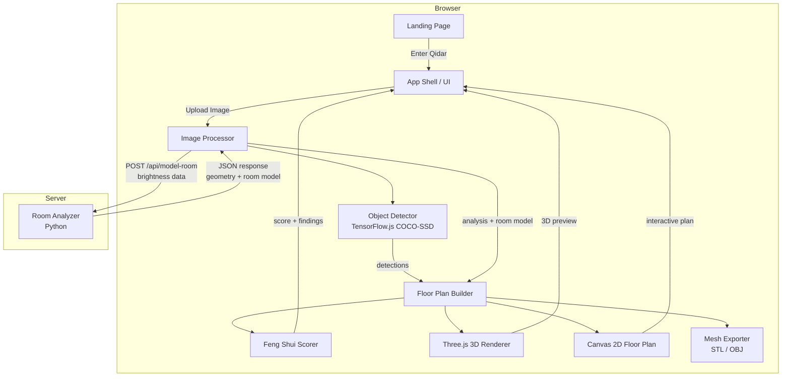
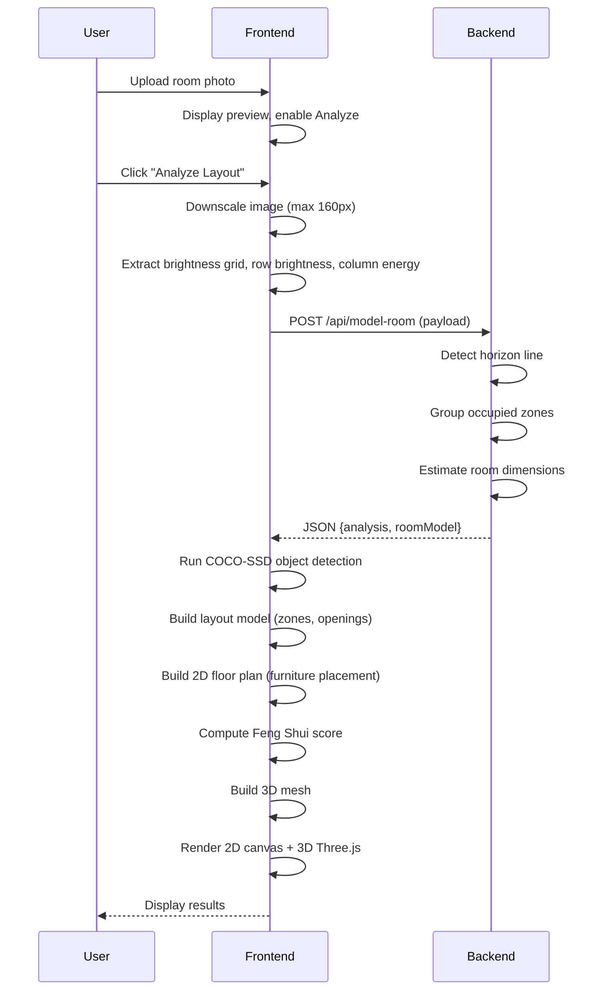

# Design Document: Qidar Room Layout Analyzer

## Overview

Qidar is a browser-based room layout analysis and Feng Shui scoring tool. Users upload a room photograph, and the system analyzes the image to detect room geometry, places furniture on a 2D floor plan, scores the layout against Feng Shui principles, renders a live 3D preview, and exports the model as STL or OBJ.

The application follows a client-heavy architecture with a thin Python backend. The frontend is a single-page vanilla JavaScript application using ES modules (no build step), Three.js for 3D rendering, and Canvas 2D for the interactive floor plan. The backend is a Python HTTP server that performs room geometry analysis from extracted image brightness data.

### Key Design Decisions

- **No build step**: The frontend uses native ES modules with an import map for Three.js, enabling direct browser execution without bundlers.
- **Client-side ML**: TensorFlow.js COCO-SSD runs in the browser for object detection, avoiding server-side GPU requirements.
- **Thin backend**: The Python server only receives pre-extracted brightness/energy arrays (not raw images), keeping payloads small and processing fast.
- **Dual deployment**: A local `ThreadingHTTPServer` for development and Vercel serverless functions for production, sharing the same `room_analysis.py` module.
- **Single-file frontend**: All frontend logic lives in `src/app.js` (~2700 lines) to avoid module coordination complexity for a self-contained tool.

## Architecture



### Data Flow Pipeline



## Components and Interfaces

### 1. Image Processor (Client)

**Responsibility**: Extracts numerical brightness/energy data from the uploaded image and sends it to the backend.

**Interface**:
```typescript
interface ImagePayload {
  imageWidth: number;       // Downscaled width (max 160px dimension)
  imageHeight: number;      // Downscaled height
  rowBrightness: number[];  // Per-row average brightness (0-255)
  columnEnergy: number[];   // Per-column horizontal gradient energy
  overallBrightness: number; // Mean brightness across all pixels
  brightnessGrid: number[][]; // Full 2D brightness array
  calibration?: CalibrationObject; // Optional reference object
}

interface CalibrationObject {
  label: string;
  realHeightMeters: number;
  pixelsPerMeter: number;
}
```

**Key behaviors**:
- Downscales to max 160px preserving aspect ratio
- Computes brightness as `R*0.299 + G*0.587 + B*0.114`
- Column energy computed only below 35% of image height
- HEIC/HEIF conversion via heic2any library when browser cannot decode natively

### 2. Room Analyzer (Python Backend)

**Responsibility**: Analyzes brightness data to detect room geometry, horizon line, occupied zones, and estimate room dimensions.

**Interface**:
```python
def analyze_room(payload: dict) -> dict:
    """
    Input: ImagePayload as dict
    Output: {
        "analysis": {
            "summary": str,
            "roomType": str,
            "cameraView": str,
            "floorPolygon": list[dict],  # 4 vertices {x, y} as percentages
            "wallZones": list[dict],      # 3 zones {name, x, y, width, height}
            "avoidZones": list[dict],     # Occupied regions
            "placementGuidance": list[str],
            "lighting": str,
            "dominantSide": str,          # "left" | "center" | "right"
            "horizonPercent": float
        },
        "roomModel": {
            "width": float,   # meters
            "depth": float,   # meters
            "height": float,  # meters
            "floorArea": float,
            "walls": list[dict]
        }
    }
    """
```

**Key algorithms**:
- **Horizon detection**: Scores each row by gradient contrast + below-vs-above brightness difference + vertical position weighting, searching between 28% and 78% of image height.
- **Occupied zone grouping**: Columns with energy > 1.15× average are marked occupied; consecutive runs are grouped with minimum span of 3% image width, max 8 zones.
- **Edge-based object detection**: When brightness grid is provided, computes horizontal/vertical gradients, thresholds at 1.3× average edge magnitude, and groups connected components via flood fill.
- **Dimension estimation**: Width from floor polygon width percentage (clamped 3.2–7.5m without calibration), depth from height percentage (clamped 3.5–9m), height defaults to 2.7m.

### 3. Object Detector (Client)

**Responsibility**: Runs TensorFlow.js COCO-SSD model on the uploaded image to detect furniture objects.

**Interface**:
```typescript
interface Detection {
  class: string;       // COCO label (e.g., "bed", "couch", "chair")
  score: number;       // Confidence 0-1
  bbox: [number, number, number, number]; // [x, y, width, height] in pixels
}

async function detectObjects(): Promise<Detection[]>
// Max 20 detections, min confidence 0.3
```

**Key behaviors**:
- Dynamically loads TensorFlow.js and COCO-SSD from CDN on first use
- Gracefully degrades if detection fails (logs warning, continues pipeline)

### 4. Floor Plan Builder (Client)

**Responsibility**: Constructs a 2D floor plan with walls, furniture footprints, and openings from room model data and detected objects.

**Interface**:
```typescript
interface FloorPlan {
  width: number;          // Room width in meters
  depth: number;          // Room depth in meters
  height: number;         // Room height in meters
  wallThickness: number;  // Default 0.15m
  boundary: Point2D[];    // Room boundary polygon
  objects: FurnitureObject[];
  openings: Opening[];
  colors: RegionColors;
}

interface FurnitureObject {
  label: string;
  source: "coco" | "grid" | "fallback" | "toolbox";
  color: [number, number, number];
  x: number;            // Position in meters from left wall
  z: number;            // Position in meters from front wall
  width: number;        // Meters
  depth: number;        // Meters
  height: number;       // Meters
  zone: "front" | "center" | "back";
  sideZone: "left" | "center" | "right";
  rotation: number;     // Radians
}

interface Opening {
  type: "door" | "window" | "entrance";
  wall: "front" | "back" | "left" | "right" | "inside";
  x: number;
  z: number;
  width: number;
  depth: number;
  manual?: boolean;
}
```

**Key behaviors**:
- Maps COCO-SSD detections to floor plan using perspective projection based on floor polygon and horizon line
- Snaps furniture to depth zones (front/center/back) and side zones (left/center/right)
- Resolves collisions by iteratively shifting objects in 0.25m steps across 4 diagonal directions
- Limits detected objects to 8 per plan
- Adds fallback furniture when fewer than 2 objects detected

### 5. Layout Model (Client)

**Responsibility**: Intermediate data structure describing room zones, anchor wall, and openings.

**Interface**:
```typescript
interface LayoutModel {
  width: number;
  depth: number;
  height: number;
  anchorWall: "left" | "right" | "back";
  zoneBands: ZoneBand[];   // front (5-32%), center (32-68%), back (68-95%)
  sideBands: SideBand[];   // left (4-34%), center (25-75%), right (66-96%)
  openings: Opening[];
}
```

**Key behaviors**:
- Anchor wall determined by dominant side from analysis
- Infers default door on wall opposite anchor, window on back wall, side window opposite dominant side
- Manual openings override inferred ones by type

### 6. Feng Shui Scorer (Client)

**Responsibility**: Evaluates the floor plan layout against Feng Shui principles and produces a score, findings, and recommendations.

**Interface**:
```typescript
interface FengShuiResult {
  score: number;           // 10-98
  verdict: string;         // "excellent harmony" | "good balance" | "workable" | "needs significant adjustment"
  findings: Finding[];
  recommendations: string[];
  elements: {
    counts: Record<string, number>;
    missing: string[];
    dominant: string;
  };
  baguaGrid: BaguaCell[][];
}

interface Finding {
  level: "good" | "warn" | "note";
  text: string;
}
```

**Scoring categories** (starting from base 50):
1. Command position (+12 / -8/-6/-10)
2. Five elements balance (+6 / -6/-3)
3. Bagua map zones (+5/-8, +3)
4. Qi flow / entry path (+6 / -10)
5. Yin/yang balance (+4 / -4)
6. Mirror placement (+3 / -6)
7. Kitchen work triangle (+4 / -4)
8. Bathroom rules (-6/-5)
9. Clutter & symmetry (+4 / -8/-2/-4)
10. Lighting (+3 / -4)

### 7. Three.js 3D Renderer (Client)

**Responsibility**: Renders the room model in 3D with orbit controls, colored walls, furniture meshes, and openings.

**Configuration**:
- WebGL renderer with antialiasing
- Perspective camera: 42° FOV
- Hemisphere light (sky/ground) + directional sun + directional fill
- OrbitControls with damping, max polar angle < π/2
- Fog for depth perception

**Key behaviors**:
- Walls rendered with image-sampled colors
- Doors as green panels, windows as semi-transparent blue panels
- Type-specific furniture geometry (beds with headboard, couches with arms, tables with legs)
- Selected object highlighted with emissive glow
- Supports both rectangular and arbitrary polygon room boundaries
- Compass overlay tracks camera orientation

### 8. Mesh Exporter (Client)

**Responsibility**: Exports the generated 3D mesh as binary STL or Wavefront OBJ.

**STL format**:
- Binary STL with 80-byte header containing "COLOR=rgba,MATERIAL=rgba"
- Per-face color encoded in attribute byte count as 15-bit RGB (5 bits per channel, valid color bit set)
- Degenerate triangles (near-zero area) removed before export

**OBJ format**:
- Vertex positions with 4 decimal places
- Triangle face indices (1-indexed)
- No material or texture data

Both formats apply the user-configured export scale factor (default 1.0 for real meters).

## Data Models

### Application State

```typescript
interface AppState {
  imageDataUrl: string;
  fileName: string;
  generating: boolean;
  analysis: RoomAnalysis | null;
  roomModel: RoomModel | null;
  layoutModel: LayoutModel | null;
  floorPlan: FloorPlan | null;
  fengShui: FengShuiResult | null;
  mesh: MeshData | null;
  markerMode: "door" | "window" | "entrance" | null;
  manualOpenings: { door: Opening[]; window: Opening[]; entrance: Opening[] };
  suppressInferredOpenings: boolean;
  opts: { wallThick: number; scale: number };
  planView: { zoom: number; panX: number; panY: number };
  selectedObjectIndex: number;
}
```

### Furniture Presets

~30 predefined furniture types organized in 5 categories:
- **Bedroom**: bed, couch, chair, desk, nightstand, dresser, wardrobe, bookshelf, tv stand
- **Bathroom**: toilet, sink, bathtub, shower, bathroom cabinet
- **Outdoor**: patio table, patio chair, lounge chair, planter, grill
- **Kitchen**: dining table, refrigerator, oven, dishwasher, kitchen island
- **Decor**: plant, lamp, rug, mirror, side table, ottoman

Each preset defines: width, height, depth (meters), RGB color, and preferred depth zone.

### Five Elements Mapping

```typescript
const ELEMENT_MAP = {
  wood: ["bed", "couch", "chair", "dresser", "nightstand", "wardrobe", "desk", "bookshelf", "bathroom cabinet", "patio chair", "lounge chair", "plant", "side table"],
  fire: ["oven", "grill", "lamp"],
  earth: ["dining table", "patio table", "kitchen island", "planter", "rug", "ottoman"],
  metal: ["tv stand", "refrigerator", "dishwasher"],
  water: ["sink", "bathtub", "shower", "toilet", "mirror"],
};
```

### Bagua Map Grid

3×3 grid mapped by object center position:
```
| knowledge      | career         | helpful people |  (front, z < depth/3)
| family         | health         | creativity     |  (center)
| wealth         | fame           | relationships  |  (back, z > depth*2/3)
  (left, x<W/3)   (center)         (right, x>W*2/3)
```

## Correctness Properties

*A property is a characteristic or behavior that should hold true across all valid executions of a system — essentially, a formal statement about what the system should do. Properties serve as the bridge between human-readable specifications and machine-verifiable correctness guarantees.*

### Property 1: State reset clears all derived data

*For any* application state (with or without existing analysis, room model, floor plan, feng shui results, and mesh), performing a reset operation (either uploading a new image or clicking the Reset button) SHALL result in all analysis-derived fields being null/empty.

**Validates: Requirements 1.3, 1.4**

### Property 2: Image downscaling preserves aspect ratio with max dimension 160

*For any* image with natural dimensions (width, height), the downscaled output SHALL have its maximum dimension equal to 160 pixels (or the original if smaller) and the aspect ratio (width/height) SHALL be preserved within ±1 pixel of rounding.

**Validates: Requirements 2.1**

### Property 3: Brightness extraction correctness

*For any* pixel grid of dimensions W×H, the computed row brightness for row Y SHALL equal the average of all pixel brightness values in that row, the overall brightness SHALL equal the mean of all pixel brightness values, and the brightness grid SHALL contain the per-pixel brightness value at each coordinate.

**Validates: Requirements 2.2**

### Property 4: Horizon line is within valid range

*For any* row brightness array of length H (where H >= 10), the detected horizon row SHALL be between `max(4, H*0.28)` and `min(H-4, H*0.78)`.

**Validates: Requirements 3.1**

### Property 5: Occupied zone grouping invariants

*For any* column energy array of length W, the grouped occupied zones SHALL each have a span of at least `max(2, W*0.03)` columns, and the total number of zones SHALL not exceed 8.

**Validates: Requirements 3.2**

### Property 6: Dominant side classification follows threshold rule

*For any* column energy array, if the average energy of the left half exceeds the right half by more than 10%, the dominant side SHALL be "left"; if the right exceeds the left by more than 10%, it SHALL be "right"; otherwise it SHALL be "center".

**Validates: Requirements 3.4**

### Property 7: Lighting classification matches brightness thresholds

*For any* overall brightness value B, the lighting description SHALL be "bright daylight" if B >= 190, "balanced ambient light" if 145 <= B < 190, "soft interior light" if 105 <= B < 145, or "dim interior light" if B < 105.

**Validates: Requirements 3.7**

### Property 8: Room type classification is deterministic

*For any* image dimensions (width, height) and occupied zone count, the room type SHALL be "wide living area" if aspect ratio >= 1.45, "furnished bedroom or lounge" if zone count >= 2, "compact bedroom" if aspect ratio <= 0.9, or "multi-purpose interior room" otherwise.

**Validates: Requirements 3.8**

### Property 9: Room dimension estimates are within clamped ranges

*For any* valid analysis payload, the estimated room width SHALL be within [3.2, 7.5] meters without calibration (or [2.8, 10] with calibration), the depth SHALL be within [3.5, 9] meters without calibration (or [3, 12] with calibration), and the height SHALL be 2.7 meters without calibration (or within [2.2, 4] with calibration).

**Validates: Requirements 3.10, 3.11, 3.12**

### Property 10: Room analysis response contains all required fields

*For any* valid payload sent to the Room Analyzer, the response SHALL contain an `analysis` object with fields (summary, roomType, cameraView, floorPolygon, wallZones, avoidZones, placementGuidance, lighting, dominantSide, horizonPercent) and a `roomModel` object with fields (width, depth, height, floorArea, walls).

**Validates: Requirements 3.13**

### Property 11: Furniture placement is always within room boundaries

*For any* furniture manipulation operation (drag, rotate, add from toolbox, or initial placement), the resulting furniture position SHALL satisfy `x >= wallThickness`, `x + effectiveWidth <= roomWidth - wallThickness`, `z >= wallThickness`, and `z + effectiveDepth <= roomDepth - wallThickness`.

**Validates: Requirements 5.2, 5.3, 7.2, 7.4, 7.5**

### Property 12: Collision resolution produces non-overlapping objects

*For any* set of furniture objects passed through collision resolution, no two objects in the result SHALL have overlapping axis-aligned bounding boxes (with 0.04m padding), unless the search space is exhausted.

**Validates: Requirements 5.5**

### Property 13: Floor plan limits detected objects to 8

*For any* number of COCO-SSD detections or avoid zones, the floor plan SHALL contain at most 8 objects from detection sources (before fallback additions).

**Validates: Requirements 5.7**

### Property 14: Manual openings override inferred openings by type

*For any* combination of manual and inferred openings, when manual doors exist the layout SHALL use only manual doors (not inferred), and when manual windows exist the layout SHALL use only manual windows (not inferred).

**Validates: Requirements 6.3**

### Property 15: Opening placement snaps to nearest wall

*For any* click point (x, z) on the floor plan, the placed opening SHALL be on the wall with the minimum perpendicular distance from the click point.

**Validates: Requirements 6.2**

### Property 16: Furniture hit detection is geometrically correct

*For any* furniture object with position (x, z), dimensions (width, depth), and rotation angle, a point SHALL be detected as hitting the object if and only if the point, when transformed into the object's local coordinate space, falls within [-width/2, width/2] × [-depth/2, depth/2].

**Validates: Requirements 7.1**

### Property 17: Zoom is clamped between 0.6x and 4x

*For any* sequence of scroll wheel events applied to the plan view, the resulting zoom level SHALL always be within [0.6, 4.0].

**Validates: Requirements 8.1**

### Property 18: Five elements count matches element mapping

*For any* set of furniture objects on the floor plan, the element counts SHALL equal the sum of objects whose normalized label maps to each element in the predefined ELEMENT_MAP.

**Validates: Requirements 9.2**

### Property 19: Bagua zone assignment follows grid division

*For any* furniture object with center position (cx, cz) in a room of dimensions (W, D), the assigned bagua zone SHALL be determined by: column = cx < W/3 → 0, cx < W*2/3 → 1, else 2; row = cz < D/3 → 0, cz < D*2/3 → 1, else 2; mapped to the 3×3 bagua grid.

**Validates: Requirements 9.3**

### Property 20: Qi flow corridor blocking detection

*For any* door position and furniture layout, a furniture object SHALL be detected as blocking qi flow if and only if its bounding box overlaps with the entry corridor (22% of room width wide, 55% of room depth deep, extending from the door position).

**Validates: Requirements 9.4**

### Property 21: Feng Shui score is always within [10, 98]

*For any* floor plan configuration (any combination of furniture, openings, room type, and lighting), the final Feng Shui score SHALL be clamped within [10, 98].

**Validates: Requirements 9.11**

### Property 22: Mesh cleaning removes degenerate triangles

*For any* mesh, after cleaning, every remaining triangle SHALL have a cross-product magnitude (area × 2) greater than 1e-10, and all non-degenerate triangles from the input SHALL be preserved in the output.

**Validates: Requirements 11.4**

### Property 23: STL export binary format correctness

*For any* mesh with N triangles, the exported STL binary SHALL have exactly 84 + N×50 bytes, with the triangle count at byte offset 80 matching N, and each triangle record containing 12 bytes of normal, 36 bytes of vertices, and 2 bytes of color attribute.

**Validates: Requirements 11.1**

### Property 24: OBJ export vertex and face count correctness

*For any* mesh with N triangles, the exported OBJ file SHALL contain exactly N×3 vertex lines (starting with "v ") and exactly N face lines (starting with "f "), where face indices are sequential 1-indexed triples.

**Validates: Requirements 11.2**

### Property 25: Export scale factor is applied uniformly

*For any* mesh and scale factor S, every vertex coordinate in the exported mesh SHALL equal the corresponding coordinate from a scale-1 build multiplied by S.

**Validates: Requirements 11.3**

## Error Handling

### Backend Errors

| Error Condition | Response | Recovery |
|---|---|---|
| Malformed JSON payload | HTTP 400 with `{"error": "..."}` | Frontend displays error in analysis summary |
| Missing required fields | HTTP 400 with descriptive error | Frontend shows failure message |
| Server unreachable | Fetch throws network error | Frontend catches, sets summary to failure message |

### Frontend Errors

| Error Condition | Handling |
|---|---|
| HEIC conversion fails | Falls back to attempting direct display; if that fails, shows error |
| COCO-SSD model load fails | Logs warning, continues pipeline without detections |
| Object detection inference fails | Logs warning, continues with empty detections array |
| WebGL context unavailable | Three.js renderer fails gracefully; 2D canvas still works |
| Image cannot be decoded | Promise rejects, generation fails with error message |

### State Consistency

- All state mutations go through the central `state` object
- `rebuildDerivedModels()` ensures layout model, feng shui, and mesh stay in sync after any furniture/opening change
- The `render()` function derives all UI state from the current `state` object (unidirectional data flow)

## Testing Strategy

### Unit Tests

Unit tests should cover:
- **Room analysis functions** (Python): `find_horizon_row`, `group_occupied_columns`, `detect_objects_from_grid`, `describe_lighting`, `describe_room_type`, `describe_camera_view`, `estimate_room_width_meters`, `estimate_room_depth_meters`, `estimate_room_height_meters`, `build_room_model`
- **Floor plan builder logic**: `snapObjectToZone`, `resolveObjectCollisions`, `buildFloorPlan2D`, `getObjectFootprintBounds`
- **Feng Shui scorer**: `buildFengShuiModel`, `objectElement`, `baguaZone`, `entryCorridor`, `isAgainstWall`
- **Mesh operations**: `cleanMesh`, `buildMeshFromFloorPlan`
- **Export functions**: `exportSTL` binary format, `exportOBJ` text format
- **Geometry utilities**: `clamp`, `findObjectAtPlanPoint`, `hitResizeHandle`, `overlapsRect`
- **Image processing**: `extractImagePayload` brightness computation

### Property-Based Tests

Property-based testing is appropriate for this project because many core functions are pure computations with clear input/output behavior and universal properties that should hold across a wide input space.

**Library**: `fast-check` (JavaScript) for frontend logic, `hypothesis` (Python) for backend logic.

**Configuration**: Minimum 100 iterations per property test.

Each property test must reference its design document property with a tag comment:
```
// Feature: qidar-room-layout-analyzer, Property {N}: {property_text}
```

**Python properties to test** (using hypothesis):
- Property 4: Horizon line range
- Property 5: Occupied zone grouping invariants
- Property 6: Dominant side classification
- Property 7: Lighting classification
- Property 8: Room type classification
- Property 9: Room dimension clamping
- Property 10: Response field completeness

**JavaScript properties to test** (using fast-check):
- Property 1: State reset
- Property 2: Image downscaling
- Property 3: Brightness extraction
- Property 11: Furniture within boundaries
- Property 12: Collision resolution
- Property 13: Object count limit
- Property 14: Manual opening override
- Property 15: Opening nearest wall
- Property 16: Hit detection geometry
- Property 17: Zoom clamping
- Property 18: Element counting
- Property 19: Bagua zone assignment
- Property 20: Qi flow blocking
- Property 21: Score clamping
- Property 22: Mesh cleaning
- Property 23: STL format
- Property 24: OBJ format
- Property 25: Scale factor

### Integration Tests

- Local server serves static files and handles `/api/model-room` POST
- End-to-end pipeline: upload image → analyze → verify floor plan generated
- HEIC conversion with sample file
- Vercel deployment configuration validation

### Smoke Tests

- Furniture preset catalog completeness (all 5 categories, ~30 types)
- Three.js renderer initialization
- Import map resolves Three.js from CDN
- Vercel function configuration (maxDuration: 60)

